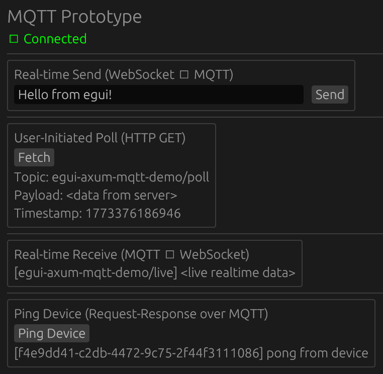
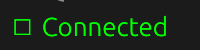
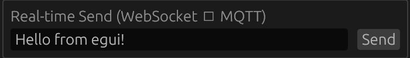
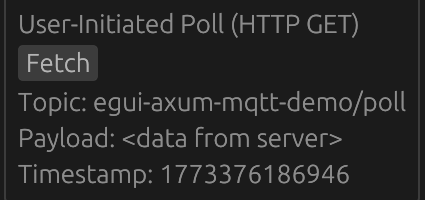
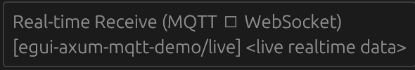
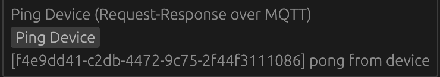

# egui + axum + mqtt demo



## Introduction

This project demonstrates the use of a Rust-based GUI application built with `egui`, a web server built with `axum`,
and MQTT communication using the `rumqttc` crate. The application demonstrates the use of HTTP and WebSocket requests
to communicate with the backend, which in turn interacts with an MQTT broker to send and receive messages in real-time.
The UI updates dynamically based on user interactions and incoming MQTT messages.

## Running

### Mosquitto MQTT Broker

Start the broker Docker container with:

```shell
$ just mosquitto
```

### Backend

Start the backend with:

```shell
$ just run-backend
```

### Frontend

This requires `trunk`, install with:

```shell
$ cargo install trunk --locked
```

Start the frontend with:

```shell
$ just run-frontend
```

Now open your web browser and navigate to `http://localhost:8080` to see the UI.

### Connection indicator



The connection indicator provides a realtime visual representation of the websocket connection status, between the
frontend and backend. When connected it will be green, and when disconnected it will be red.

### Real-time Send



When the user clicks the Send button, this mechanism sends data from the frontend to the backend immediately, via a
websocket connection. The backend receives the message and publishes it to the MQTT broker on the `send` topic.

Start an MQTT subscriber on the `send` topic with:

```shell
$ mosquitto_sub -h localhost -p 1883 -t 'egui-axum-mqtt-demo/send' -v
```

Click the "Send" button and you should see the message appear in the backend log, and subscriber terminal.

### User-Initiated Poll



When the user clicks the "Fetch" button, this mechanism performs an HTTP GET request to the backend, which returns the
last message published to the MQTT broker on the `poll` topic. If no message has been published, the UI will show an
"HTTP 404" error, otherwise the contents of the message will be displayed.

To send a message to the `poll` topic, start an MQTT publisher with:

```shell
$ mosquitto_pub -t egui-axum-mqtt-demo/poll -m "<data from server>"
```

The UI will fetch the message from the backend and display it, similar to:

```plaintext
Topic: egui-axum-mqtt-demo/poll
Payload: <data from server>
Timestamp: 1773376893336
```

### Real-time Receive



When a message is published to the `live` topic, the backend receives it and immediately sends it to the frontend via
the websocket connection. The UI immediately updates its display to show the new message.

To send a message to the `live` topic, start an MQTT publisher with:

```shell
$ mosquitto_pub -t egui-axum-mqtt-demo/live -m "<live realtime data>"
```

The UI should update to show the new message.

### Ping Device



This mechanism illustrates a user-initiated action that triggers a backend process. When the user clicks the "Ping
Device" button, a message is sent over the websocket to the backend, which publishes a message to the `ping/request`
topic. A subscriber can listen for this message and respond by publishing a message to the `ping/response` topic. The
backend receives this response and sends it back to the frontend, which updates the UI to show the response.

To listen for ping requests, start an MQTT subscriber with:

```shell
$ mosquitto_sub -h localhost -p 1883 -t 'egui-axum-mqtt-demo/ping/request' -v
```

Click "Ping Device" and a message similar to the following should appear in the subscriber's terminal:

```plaintext
egui-axum-mqtt-demo/ping/request {"correlation_id":"b72973b3-80cd-4e64-86ba-7479bb042c2c","message":"ping"}
```

Copy the `correlation_id` from the request and publish the following response:

```shell
$ mosquitto_pub -t egui-axum-mqtt-demo/ping/response -m '{"correlation_id":"b72973b3-80cd-4e64-86ba-7479bb042c2c","message":"pong from device"}'
```

The UI should update to show the response message.

## MQTT Topics

The following MQTT topics are used in this demo:

* `egui-axum-mqtt-demo/send`: Used for real-time sending of messages sent from the frontend to the backend.
* `egui-axum-mqtt-demo/poll`: Used for user-initiated polling of messages by the frontend, from the backend.
* `egui-axum-mqtt-demo/live`: Used for real-time receiving of messages by the frontend, sent from the backend.
* `egui-axum-mqtt-demo/ping/request`: Used for sending ping requests from the frontend to the backend.
* `egui-axum-mqtt-demo/ping/response`: Used for sending ping responses from the backend to the frontend, in response to
  ping requests.

A user can monitor and interact with these topics via `mosquitto_pub` and `mosquitto_sub` command-line tools.
